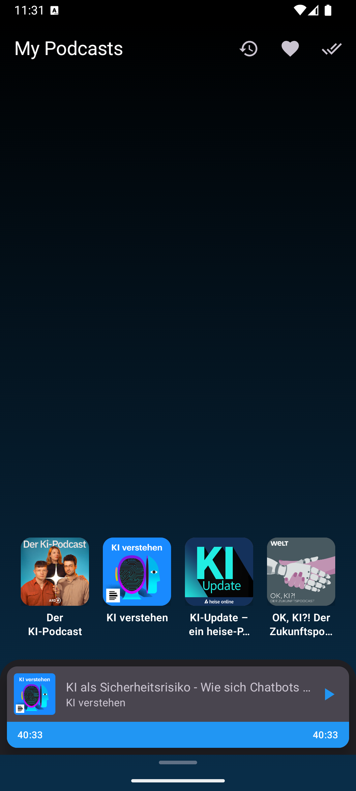
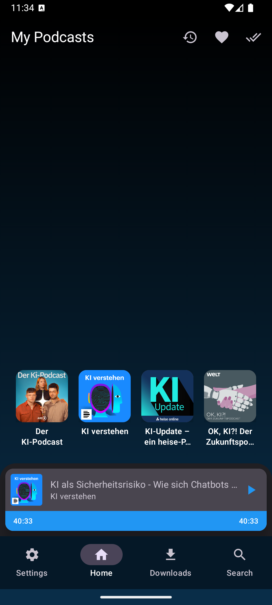
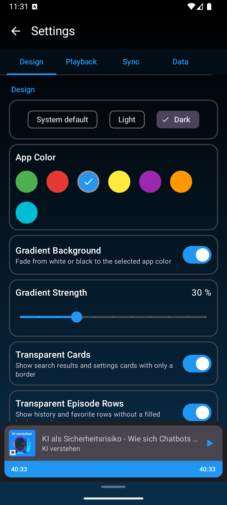
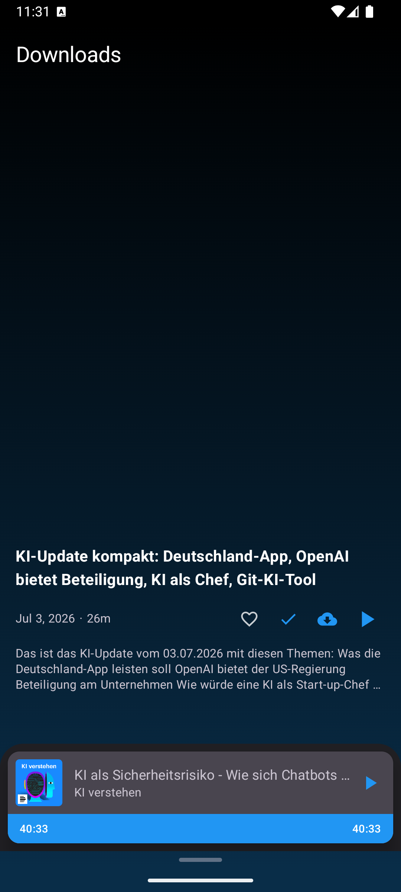
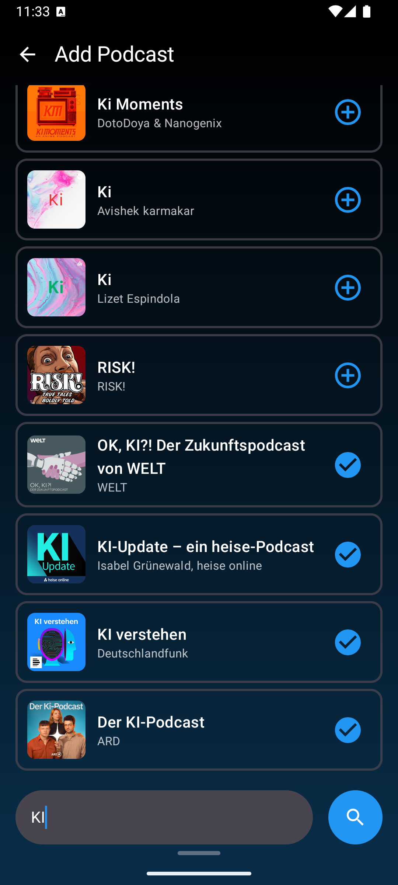
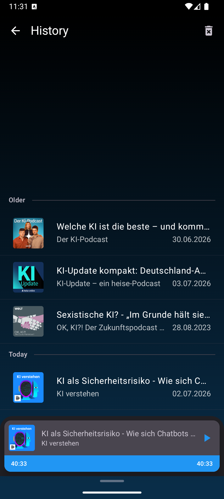
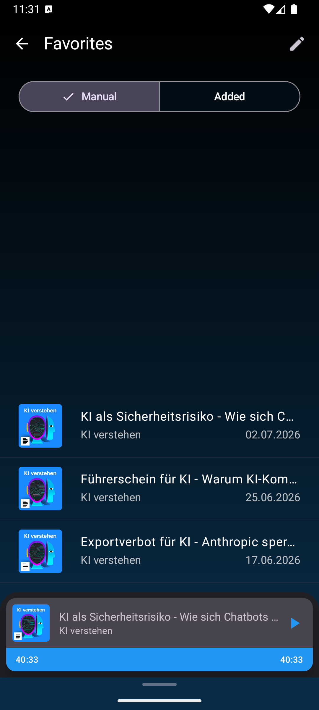
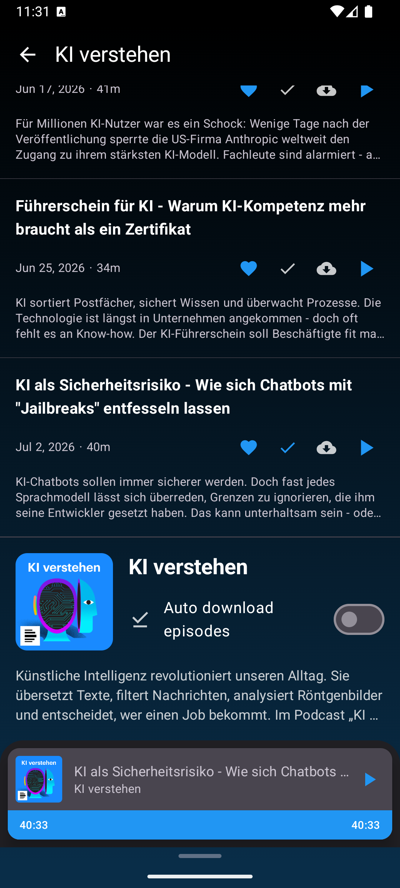
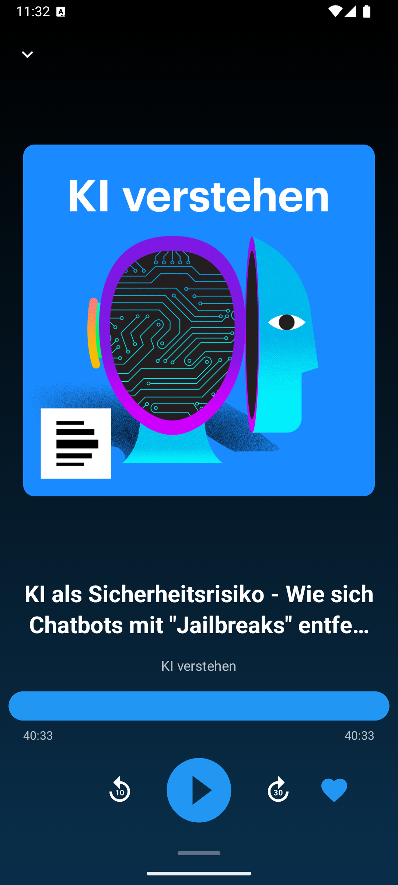

# PocastCloni

PocastCloni ist eine Android-Podcast-App mit Fokus auf lokale Bibliothek,
RSS-Synchronisierung, Wiedergabe, Downloads und stark anpassbarer Bedienung.

## Features

- Podcast-Abos per RSS-URL oder iTunes-Suche hinzufügen
- RSS-Synchronisierung als Smart Stream oder vollständiger Feed-Refresh
- Hintergrundprüfung auf neue Episoden mit einstellbarem Intervall
- Streaming und lokale Downloads mit Media3 ExoPlayer
- Option zum Speichern in den Android-Downloads-Ordner
- Auto-Download pro Podcast mit globalem Download-Limit
- Auto-Cleanup für abgespielte Episoden mit Keep-Limit und Intervall
- Favoriten mit manueller Sortierung oder Sortierung nach Hinzufügedatum
- Verlauf und Favoriten mit Datumsgruppen wie Heute, Gestern, letzte Woche,
  letzter Monat, letztes Jahr und älter
- Episodenlisten mit Veröffentlichungsdatum, Podcastname und Wiedergabestatus
- Mini-Player und Full-Player mit Fortschritt, Zeitanzeige und Skip-Steuerung
- Mini-Player-Zeitoverlay auf der Timeline optional aktivierbar
- Bottom-Bar-Navigation mit Clean Mode, Swipe-Reveal und Auto-Hide-Verzögerung
- Wisch-Navigation zwischen den Hauptbereichen Settings, Home, Downloads und Search
- One-Handed Mode für besser erreichbare Listen und Navigation
- Hell-/Dunkel-/System-Theme mit Akzentfarbe und optionalem Hintergrundverlauf
- Einstellbare Verlaufstärke, transparente Karten und transparente Episodenzeilen
- Settings in Tabs für Design, Playback, Sync und Data
- Backup & Restore für Podcasts, Favoriten, Verlauf und Einstellungen
- Statistikansicht und Reset-Funktionen

## Screenshots

Aktuelle Emulator-Screenshots:

| Home | Home with Bottom Bar |
|---|---|
|  |  |

| Settings | Downloads |
|---|---|
|  |  |

| Search | History |
|---|---|
|  |  |

| Favorites | Podcast Detail |
|---|---|
|  |  |

| Player | |
|---|---|
|  | |

## Tech-Stack

- Kotlin + Jetpack Compose (Material 3)
- Hilt für Dependency Injection
- Room für lokale Datenbank und Migrationen
- DataStore für Einstellungen
- Retrofit/OkHttp + Jackson XML für RSS und Suche
- Media3 ExoPlayer für Audio-Wiedergabe
- WorkManager für Downloads, Feed-Updates, Backup und Cleanup
- Coil für Bildladen
- Detekt, ktlint, Unit- und Instrumentation-Tests für Qualitätssicherung

## Voraussetzungen

- Android Studio
- JDK 17
- Android SDK mit compileSdk 34
- minSdk 26, targetSdk 34

## Build & Run

Linux/macOS:

```bash
./gradlew assembleDebug
```

Windows:

```powershell
.\gradlew.bat assembleDebug
```

Release-Build lokal:

```powershell
.\gradlew.bat assembleRelease
```

Signing-Schlüssel und lokale Pfade bleiben lokal und werden nicht ins Repository
committed.

## Checks

```powershell
.\gradlew.bat testDebugUnitTest
.\gradlew.bat detekt
```

## Projektstruktur

- `app/` App-Code, Ressourcen, Datenbank-Schemas und Tests
- `gradle/` Gradle Wrapper und Versionskatalog
- `build.gradle.kts` / `settings.gradle.kts` Root-Build-Konfiguration
- `detekt.yml` Detekt-Regeln
- `.editorconfig` gemeinsame Editor- und Formatierungsregeln

## Lizenz

Dieses Projekt steht unter der Mozilla Public License 2.0 (`MPL-2.0`).
Details siehe `LICENSE`.
