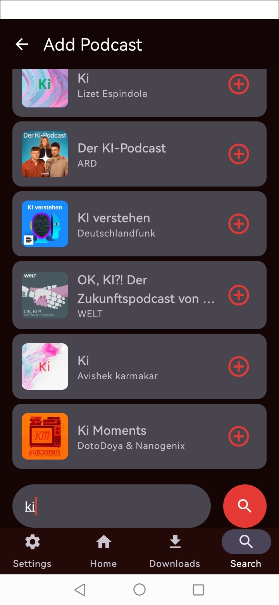
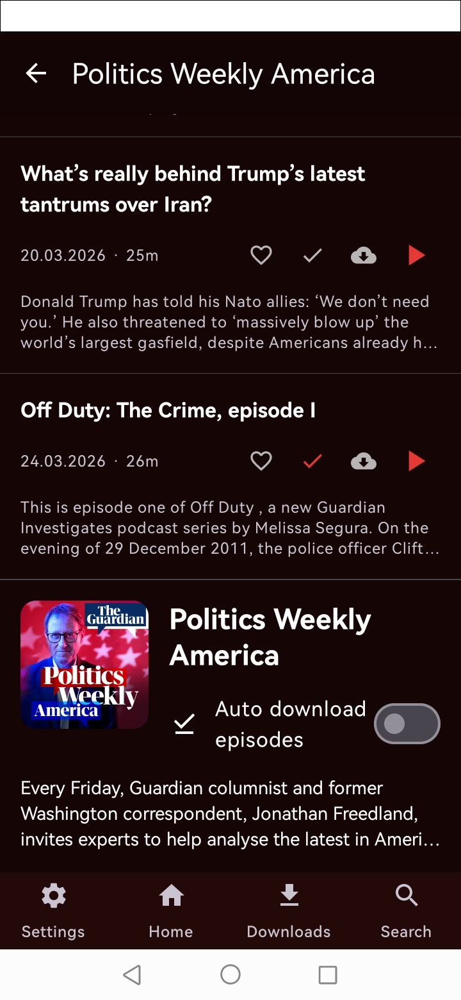
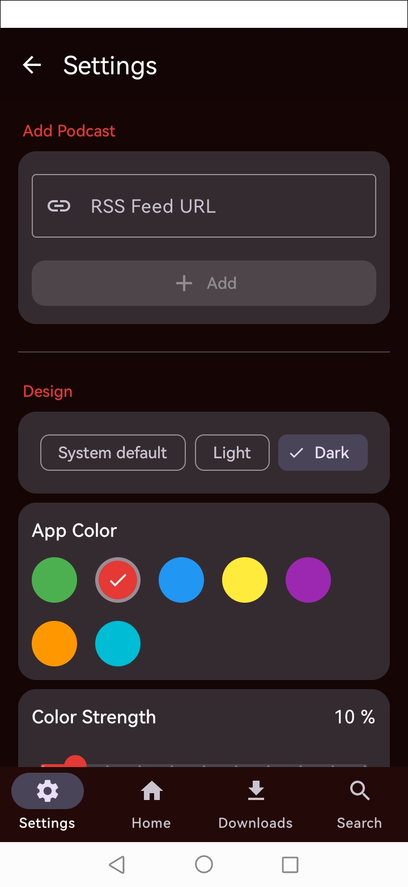
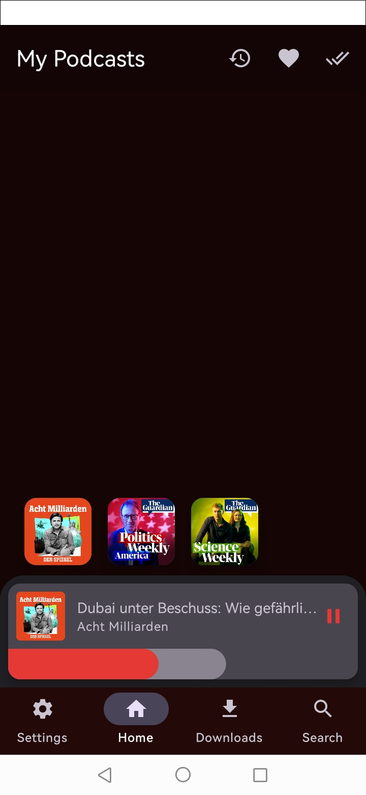
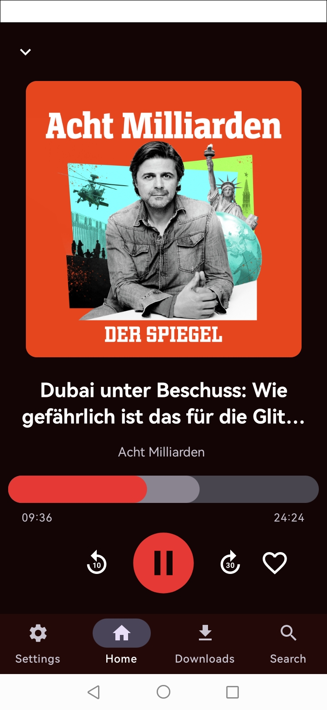

# PocastCloni

PocastCloni ist eine Android-Podcast-App mit Fokus auf lokale Bibliothek, Wiedergabe und Feed-Synchronisierung.

## Features

- Podcast-Abos per RSS-URL oder Suche
- Episoden-Streaming und Download
- Favoriten und Verlauf
- Hintergrund-Sync auf neue Episoden
- Backup & Restore
- Anpassbare Einstellungen (Theme, Layout, Buffer, Cleanup, Statistik)

## Screenshots







## Tech-Stack

- Kotlin + Jetpack Compose (Material 3)
- Hilt (Dependency Injection)
- Room (lokale Datenbank)
- Retrofit/OkHttp + Jackson XML (RSS)
- Media3 ExoPlayer (Audio-Wiedergabe)
- WorkManager (Hintergrundjobs)

## Voraussetzungen

- Android Studio (aktuelle stabile Version)
- JDK 17
- Android SDK (minSdk 26, targetSdk 34)

## Build & Run

```bash
./gradlew assembleDebug
```

Windows:

```powershell
.\gradlew.bat assembleDebug
```

## Projektstruktur

- `app/` App-Code, Ressourcen, Tests
- `gradle/` Wrapper und Versionskatalog
- `build.gradle.kts` / `settings.gradle.kts` Root-Build-Konfiguration

## Lizenz

Dieses Projekt steht unter der MIT-Lizenz. Details siehe `LICENSE`.
